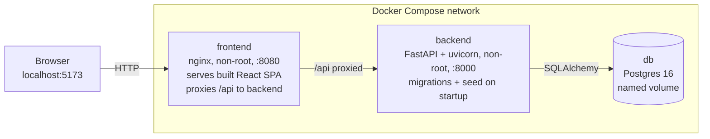

# JobPortal

A full-stack job application platform connecting HR teams with candidates. HR
users post and manage job openings and review incoming applications; candidates
browse open roles and apply with a cover letter.

---

## 1. Overview

Two roles, one workflow:

- **HR** — post roles under their company, publish them or keep them as
  drafts, edit and delete their own postings, review applicants, see a ranked
  shortlist for each posting, message applicants, and move each application
  through a pipeline (Submitted → Under review → Accepted / Rejected).
- **Candidate** — browse, search and filter published roles, apply once per
  role with a cover letter, keep a profile that improves their ranking, track
  every application, and read invites from hiring teams.

Authorisation is enforced on every endpoint by the API, not by hiding buttons
in the UI.

---

## 2. Architecture



**Request path.** The browser only ever talks to one origin. nginx serves the
static bundle and proxies `/api` to the backend over the Compose network, so
there is no CORS preflight and no API hostname baked into the JavaScript that
would be correct on only one machine.

**Startup order.** `backend` waits for the database's healthcheck — not merely
its container starting, since Postgres accepts then drops connections during
init — and `frontend` waits for the backend's. The backend entrypoint runs
`alembic upgrade head` and seeds the demo accounts before uvicorn binds. Both
are no-ops once done, so restarts are safe.

**Layering.** Routes translate outcomes into status codes, `app/services/*`
holds the rules, `app/models/*` holds the schema. Authorisation decisions live
in the service layer so they are testable without HTTP and cannot be bypassed
by a second caller.

---

## 3. How to run

**Requirements:** Docker Desktop (or Docker Engine + Compose v2). Nothing else
— no Python, Node, or Postgres on the host.

```bash
git clone https://github.com/abhishekvishwakarma007/job-portal.git
cd job-portal
docker compose up --build
```

That is the whole procedure. **No `.env` file is required** — Compose supplies
development-only values, explained under [Security notes](#8-security-notes).

| Service | URL |
| --- | --- |
| **UI — start here** | **http://localhost:5173** |
| API | http://localhost:8000 |
| Interactive API docs | http://localhost:8000/docs |
| Health probe | http://localhost:8000/health |

First boot takes a couple of minutes while the images build. The stack is ready
when all three services report `healthy` in `docker compose ps`.

Stop with `docker compose down`, or `docker compose down -v` to discard the
database as well.

**If a port is already in use.** The stack publishes 5173, 8000, and 5432. A
machine already running Postgres will collide on the last of these, and Docker
reports it as `address already in use` before anything starts. Each is
overridable:

```bash
POSTGRES_PORT=5433 BACKEND_PORT=8001 FRONTEND_PORT=5174 docker compose up --build
```

The database port is bound to loopback only, and nothing outside the host needs
it — the containers reach Postgres over the compose network.

---

## 4. Test credentials

Seeded automatically on first boot. Both are development-only.

**The two the brief publishes — start with these:**

| Role | Email | Password |
| --- | --- | --- |
| **HR** | `admin@test.com` | `Admin@1234` |
| **Candidate** | `user@test.com` | `User@1234` |

**Additional demo accounts**, so the app is populated rather than empty. Each
HR account represents one employer and owns only that company's postings.

| Role | Email | Password | Represents |
| --- | --- | --- | --- |
| HR | `hr.kestrel@test.com` | `Kestrel@1234` | Kestrel Studio |
| HR | `hr.bluepeak@test.com` | `Bluepeak@1234` | Bluepeak Analytics |
| Candidate | `ravi@test.com` | `Ravi@1234` | Backend engineer |
| Candidate | `lena@test.com` | `Lena@1234` | Product designer |
| Candidate | `amara@test.com` | `Amara@1234` | Analytics student |

`admin@test.com` represents **Northwind Labs**. Every candidate arrives with a
filled-in profile, and five applications are already in the pipeline across
three statuses.

You can also register a new account of either role from the UI.

---

## 5. Feature walkthrough

**As HR** — `admin@test.com` / `Admin@1234`

1. Sign in; you land on **My postings**, an expandable list of your own roles.
2. **Post a role**: title, company, location, employment type, description.
   Leave *Publish immediately* ticked, or untick it to save a draft.
3. A draft carries a **Draft** badge and is invisible to everyone else,
   including at its direct URL.
4. **Expand a posting** to reveal its actions and its **Top matches** — the
   best-fitting applicants, each with a percentage and the terms that placed
   them. Ranking reads both the cover letter and the candidate's profile, with
   listed skills weighted higher.
5. **Contact applicant** writes them a message. Nothing is emailed; it arrives
   in the candidate's **Invites**.
6. **All applicants** shows the full pipeline for a posting, with a dropdown to
   move each person through it.
7. **Edit**, **Publish / Unpublish**, or **Delete** any posting you own.
   Deleting warns that its applications go with it.

**As Candidate** — `user@test.com` / `User@1234`

1. Sign in; you land on **Browse jobs**.
2. Filter by **title, company, location, or employment type** — they combine,
   and the list is newest-first with published roles only.
3. **Expand a role** to read the full description and apply without leaving the
   list.
4. Applying to the same role again is refused; the UI reports it as already
   submitted.
5. **Profile** holds your basic details, summary, key skills, career
   preferences, employment and education. Each section saves on its own, and
   your skills feed the shortlist HR sees.
6. **My applications** lists everything you applied to with its current status.
7. **Invites** shows messages from hiring teams, as cards naming the role and
   company.

**Worth trying**

- Signed in as the candidate, visit `/manage` — the HR area is not available.
- Copy a draft posting's URL as HR, then open it as the candidate: it returns
  404, not 403, so the draft's existence is never revealed.
- Sign in as `hr.kestrel@test.com` — you see only Kestrel Studio's postings and
  cannot reach Northwind's pipeline, even by id.
- Add a skill to your profile that appears in a posting, then look at that
  posting's Top matches as HR: your score moves.

---

## 6. Tech stack

| Layer | Choice | Why |
| --- | --- | --- |
| Backend | FastAPI, Python 3.11 | Typed request/response models, OpenAPI for free |
| ORM / migrations | SQLAlchemy 2.0, Alembic | Explicit schema, versioned changes |
| Database | Postgres 16 | Native enums, UUIDs, functional unique indexes |
| Auth | PyJWT (HS256), bcrypt | Stateless access tokens, per-password salting |
| Frontend | React 18, TypeScript, Vite | Strict typing, fast builds |
| Styling | Tailwind CSS + a small hand-written system | Utilities for new work, existing styles untouched (preflight off) |
| Routing | React Router 6 | — |
| Serving | nginx (unprivileged image) | Static assets plus API proxy, no Node in production |
| Tests | pytest, Vitest, Testing Library | Real Postgres, no mocked database |
| Quality | ruff, mypy (strict), ESLint, tsc | Enforced in CI |
| CI | GitHub Actions | Lint, types, tests, plus a live-stack smoke test |

---

## 7. API reference

Interactive documentation at **http://localhost:8000/docs**.

| Method | Path | Access |
| --- | --- | --- |
| `POST` | `/api/v1/auth/register` | Public, rate limited |
| `POST` | `/api/v1/auth/login` | Public, rate limited |
| `POST` | `/api/v1/auth/refresh` | Valid refresh token |
| `POST` | `/api/v1/auth/logout` | Valid refresh token |
| `GET` | `/api/v1/auth/me` | Authenticated |
| `GET` | `/api/v1/jobs` | Public |
| `GET` | `/api/v1/jobs/{id}` | Public; drafts owner-only |
| `GET` | `/api/v1/jobs/mine` | HR |
| `POST` | `/api/v1/jobs` | HR |
| `PATCH` | `/api/v1/jobs/{id}` | HR, owner only |
| `DELETE` | `/api/v1/jobs/{id}` | HR, owner only |
| `GET` | `/api/v1/jobs/{id}/applications` | HR, owner of the job |
| `POST` | `/api/v1/applications` | Candidate |
| `GET` | `/api/v1/applications/mine` | Candidate |
| `GET` | `/api/v1/applications/{id}` | Its author, or the job's owner |
| `PATCH` | `/api/v1/applications/{id}` | HR, owner of the job |
| `POST` | `/api/v1/applications/{id}/contact` | HR, owner of the job |
| `GET` | `/api/v1/jobs/{id}/recommendations` | HR, owner of the job |
| `GET` | `/api/v1/profile/me` | Candidate |
| `PATCH` | `/api/v1/profile/me` | Candidate |
| `GET` | `/api/v1/notifications/mine` | Authenticated |
| `PATCH` | `/api/v1/notifications/{id}/read` | Recipient only |
| `GET` | `/health` | Public |

Browse accepts `search` (title), `company`, `location`, and `employment_type`
filters, which combine with AND, plus `limit` and `offset`.

---

## 8. Security notes

**Passwords.** bcrypt with a per-password salt, so one cracked hash reveals
nothing about the others. The policy is 8 characters minimum plus 3 of 4
character classes, enforced server-side and mirrored in the browser for
feedback only. Passwords beyond bcrypt's 72-**byte** limit are refused rather
than silently truncated, which would make two different passwords one
credential.

**No account enumeration.** A wrong password and an unknown address return a
byte-identical 401. The service also verifies against a dummy hash when no
account matches, so both paths cost the same ~200 ms — otherwise timing would
answer the question the status code refuses to.

**404 over 403.** Reaching a record you do not own returns 404, never 403. A
403 confirms the record exists, which is enough to map another account's
postings by trying ids. Unpublished drafts are 404 to everyone but their
author. Role gates on *endpoints* still return 403, because an endpoint's
existence is already public in the OpenAPI schema.

**Live authorisation.** The user is re-read from the database on every request
rather than trusted from the token's claims, so deactivating an account or
changing a role takes effect immediately instead of whenever the token expires.

**Race-condition backstops in the schema.** Case-insensitive email uniqueness
is a functional unique index on `lower(email)`; one-application-per-job is a
composite unique constraint. A service-layer check loses the race between two
concurrent requests — the database cannot.

**Brute-force resistance.** Two independent controls. A per-caller
sliding-window rate limit on login and registration answers 429 with
`Retry-After`; a per-account lockout engages after 5 failures with exponential
backoff, capped at an hour. The lockout is silent — a locked account answers
exactly like a wrong password — trading a confusing message for enumeration
resistance.

**Refresh tokens** rotate on every use, and only their SHA-256 hashes are
stored. Replaying a spent token is treated as theft: the user's entire token
family is revoked, because the attacker's copy and the victim's are
indistinguishable.

**Mass assignment.** Request schemas name only client-writable fields. A body
carrying `is_active`, `status`, or `created_by_id` has it ignored, not honoured.

**Messaging cannot be misaddressed.** The recipient of an HR message comes from
the application, never the request body, so a message cannot be sent to someone
who did not apply. Only the posting's owner may write to its applicants.

**The match score is labelled.** The recommendation endpoint returns its
`method` (`keyword-overlap`) in the payload, so no client can present a keyword
count as an assessment of whether someone can do the job. The denominator is
the posting's vocabulary, so padding a cover letter or profile cannot inflate a
score — only covering more of what the posting asks for can.

**XSS.** User-supplied text — job descriptions, cover letters — renders as
text, never through `dangerouslySetInnerHTML`. nginx sets a CSP with no
`unsafe-inline` for scripts, plus `X-Frame-Options: DENY` and `nosniff`.

**Committed credentials.** `docker-compose.yml` contains a development-only
`SECRET_KEY` and database password, deliberately: the assessment requires a
fresh clone to boot on one command with no `.env`, and the config refuses to
start without them. Every value accepts an environment override
(`${SECRET_KEY:-…}`), which is how a real deployment injects its own. **Rotate
these for any deployment reachable by anyone else** — whoever holds the signing
key can forge a token for any user, including an HR account.

---

## 9. Trade-offs

**Tokens in `localStorage`, not httpOnly cookies.** localStorage is readable by
any script on the origin, so a successful XSS could steal a token; the CSP
forbidding inline and third-party scripts is what makes that acceptable here.
An httpOnly cookie resists XSS but requires CSRF protection on every mutating
request. For a single-origin stack the simpler surface was the better trade.
**A production deployment holding real candidate data should move to httpOnly
refresh cookies.**

**Rate limiting is in-process.** It counts requests inside one worker, so
several replicas would each allow the full quota. Doing better needs shared
state (Redis) — a fourth service this stack does not otherwise need. The
durable control against a targeted attack is the database-backed lockout, which
holds regardless of process count.

**Rate limiting keys on the direct peer address**, not `X-Forwarded-For`: that
header is attacker-supplied unless a trusted proxy overwrites it. Behind a real
load balancer this needs to read whatever the balancer sets.

**Registration reveals whether an address exists** — a 409 on a duplicate.
There is no way to confirm a new account without it, so the endpoint is rate
limited to make the oracle expensive rather than free.

**Access tokens are not revocable.** Logout revokes the refresh token; the
access token expires on its own within 15 minutes. Revoking it would mean
consulting a blocklist on every request, which is exactly the cost stateless
tokens exist to avoid.

---

## 10. Testing

```bash
# Backend — requires the database running: docker compose up -d db
cd backend && pytest -q

# Frontend
cd frontend && npm test
```

Backend tests run against a **real Postgres**, never SQLite or mocks: the
schema relies on native enums, UUIDs, functional indexes, and server-side
defaults, so a stand-in would pass tests that production fails. The schema is
built by running the **actual migrations**, so a migration that drifted from
the models fails here rather than in deployment. Every table is truncated
between tests, so ordering does not matter.

Coverage concentrates on the boundaries that matter: cross-tenant 404s, every
role gate, the duplicate-apply race at the database level, no-enumeration
login, account lockout, and refresh-token replay detection.

**Local gate.** `pre-commit` runs ruff, ruff-format, eslint and `tsc` before a
commit is created, so a formatting slip is caught in the terminal rather than
as a red tick ten minutes later:

```bash
pip install pre-commit && pre-commit install
```

Backend coverage is gated at 90% in `pyproject.toml` and enforced in CI; it
currently sits at 99%.

**End-to-end suite.** `backend/tests_e2e` runs against a *running* stack over
HTTP — no TestClient, no dependency overrides. A pass means the containers, the
proxy, the migrations, and the seed all did their jobs, not merely that the
Python functions agree with each other.

```bash
docker compose up -d --build
cd backend && pytest tests_e2e -q
```

It covers the journey this README describes — sign in with the published
credentials, post a role, apply, be refused a second time, advance the
application, receive a message — plus properties only a real stack shows: the
SPA fallback serving deep links, API 404s staying JSON rather than being
swallowed by that fallback, and nginx's security headers arriving intact.

These are excluded from the default `pytest` run, since they need a stack.

CI runs lint, type checks, and both unit suites on every push, plus a job that
starts the whole stack with `docker compose up --build`, waits for every
service to report healthy, and then runs the end-to-end suite against it.

---

## 11. Known limitations

| Area | Limitation |
| --- | --- |
| Token storage | `localStorage` rather than httpOnly cookies — see Trade-offs |
| Rate limiting | Per-process; not shared across replicas |
| Proxy headers | `X-Forwarded-For` not trusted; needs configuration behind a real load balancer |
| Search | Title only, `ILIKE` — no full-text index or relevance ranking |
| Pagination | Offset-based; fine at this scale, drifts under concurrent inserts |
| File uploads | No CV or résumé upload; the cover letter is plain text |
| Email | No verification, password reset, or notifications |
| Audit log | Status changes are not written to a separate audit table |
| Roles | HR and Candidate only; no super-admin tier |
| Token cleanup | Expired refresh-token rows are not pruned by a background job |
| Accessibility | Labels and keyboard paths covered; not screen-reader audited |
| Applicant ranking | Keyword overlap only — no semantic matching or ML |
| Messaging | In-app only; no email is sent, by design for a review environment |
| Resume upload | Not implemented; profiles are structured text, no file storage |
| Profile sections | Employment and education are free text, not structured rows |

---

## 12. Notes on Claude Code usage

Claude Code was the primary development assistant, driven test-first through a
project skill (`.claude/skills/tdd-feature`) that required a failing test —
failing for the *right* reason, not an import error — before any
implementation.

The commit history is the honest record. Alongside features it contains genuine
fix-up commits for problems found by **running the stack rather than trusting
the suite**:

- Seed accounts created at `@jobportal.test` that could never log in, because
  `email-validator` refuses special-use TLDs. Every service-level test passed
  while the API rejected the documented credentials at its boundary.
- A `.gitignore` rule (`lib/`, inherited from the Python template) silently
  excluding `frontend/src/lib` — the entire API client would have been missing
  from a fresh clone while working perfectly on the developer's machine.
- Autogenerated Alembic downgrades that left Postgres enum types behind, making
  a rollback impossible to re-apply.
- Case-insensitive email uniqueness that lived only in Python, so any non-ORM
  write path could create two accounts for one inbox.

Each was found by exercising the running application, and each carries a
regression test that fails against the old behaviour.
